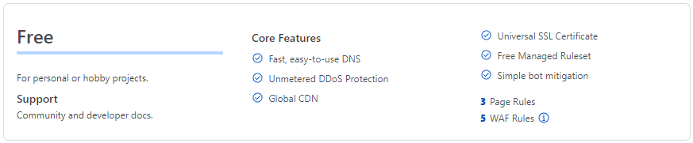
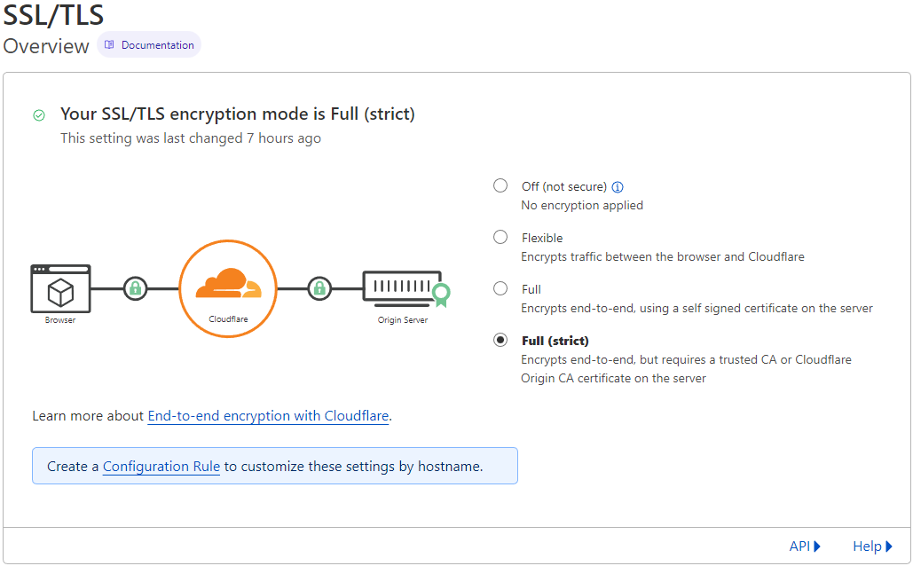

# Creating NGINX Reverse Proxy for HomeLab

Using NGINX reverse proxy we only required to open a single port (HTTPS) to access all web services hosted at home. 

We will use Cloudflare free tier services to provide DNS and certificates to get access to web services. 


Best of all, all traffic can be proxied for DDoS protection and encrypted so your IP is never exposed.



## Steps
1. Register a Domain Name of your choice
2. Register an account with Cloudflare
3. Transfer Domain DNS to Cloudflare. You may need to wait a couple of hours for DNS to propagate
4. Generate CSR for the reverse proxy
   ```
   ### tls.cnf
   [ req ]
   default_bits       = 2048
   distinguished_name = req_distinguished_name
   req_extensions     = req_ext
   [ req_distinguished_name ]
   countryName                 = Country Name (2 letter code)
   stateOrProvinceName         = State or Province Name (full name)
   localityName               = Locality Name (eg, city)
   organizationName           = Organization Name (eg, company)
   commonName                 = Common Name (e.g. server FQDN or YOUR name)
   [ req_ext ]
   subjectAltName = @alt_names
   [alt_names]
   DNS.1   = *.yourdomain.com
   DNS.2   = *.yourdomain.net
   
   ### Ensure that you use a wild card name when prompt for commonName *.yourdomain.com 
   openssl req -out tlscert.csr -newkey rsa:2048 -nodes -keyout tlscertpriv.key -config tls.cnf
   ```
5. Request Cloudflare Certificate
   - Copy the content in tlscert.csr
   - Go to Cloudflare portal under SSL/TLS, Origin Server and click Create Certificate
   - Select "Use my private key and CSR" to paste the content from tlscert.csr
   - Copy the generate Origin Certificate (Key Format - PEM) and save into a file (cloudflare_orgin.pem)
6. Download [Cloudflare Origin CA root certificates](https://developers.cloudflare.com/ssl/static/origin_ca_rsa_root.pem) certificate
7. Merge the Origin Certificate and Cloudflare Origin CA root certificates into full chain certificate
   `cat cloudflare_orgin.pem origin_ca_rsa_root.pem >fullchain.pem`
   
8. Deploy NGINX and configure the reverse proxy to use the certificate
   ```
   events {
     worker_connections 4096;
   }

   http {
     upstream webservers {
       server app1.localdomain:8096;
       server app2.localdomain;
     }

     server {
       listen 443 ssl;
       server_name app1.*;
       ssl_protocols       TLSv1 TLSv1.1 TLSv1.2;
       ssl_certificate       /etc/nginx/tls/fullchain.pem;
       ssl_certificate_key   /etc/nginx/tls/tlscertpriv.key;

       location / {
          client_max_body_size 4096m;
          proxy_http_version 1.1;
          proxy_set_header Upgrade         $http_upgrade;
          proxy_set_header Connection      "Upgrade";
          proxy_set_header Host            $http_host;
          proxy_set_header X-Real-IP       $remote_addr;
          proxy_set_header X-Forward-For   $proxy_add_x_forwarded_for;
          proxy_set_header X-Forward-Proto $scheme;
          proxy_redirect off;
          proxy_pass http://app1.localdomain:8096;
       }
     }
     server {
       listen 443 ssl;
       server_name retropie.*;
       ssl_protocols       TLSv1 TLSv1.1 TLSv1.2;
       ssl_certificate       /etc/nginx/tls/fullchain.pem;
       ssl_certificate_key   /etc/nginx/tls/tlscertpriv.key;

       location / {
          client_max_body_size 4096m;
          proxy_http_version 1.1;
          proxy_set_header Upgrade         $http_upgrade;
          proxy_set_header Connection      "Upgrade";
          proxy_set_header Host            $http_host;
          proxy_set_header X-Real-IP       $remote_addr;
          proxy_set_header X-Forward-For   $proxy_add_x_forwarded_for;
          proxy_set_header X-Forward-Proto $scheme;
          proxy_redirect off;
          proxy_pass https://app2.localdomain;
       }
     }
   }
   ```
    
   
   
